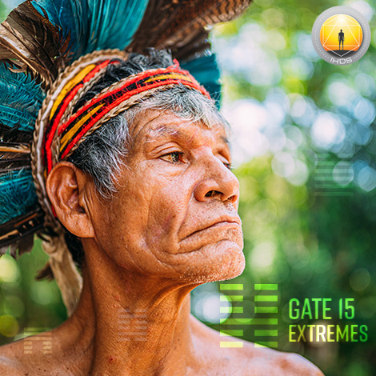
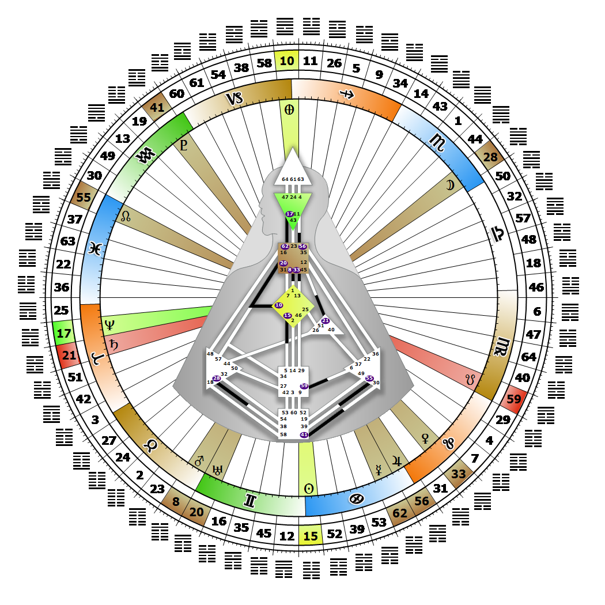

# Gate 15 - Modesty

**June 24, 2026**

## *Gate of Extremes - The Love of Humanity*

> The quality of behavior which expresses the proper balance between extremes. The possible extremes 
are lived out in life's rhythms. This is the gate of the 'Aura'.

### Left Angle Cross of Prevention | Godhead - Parvati

*Quarter of Civilization,  the Realm of DubheTheme: Purpose fulfilled through FormMystical Theme: Womb to Room*

---

This Gate is part of the Channel of Rhythm, The Design of Being in the Flow, linking the G Center (Gate 15) to the Sacral Center (Gate 5). Gate 15 is part of the Collective Understanding (Logic) Circuit with the keynote of sharing.

Gate 15 is the love of humanity. It has the capacity to accept and to find a place in society for the full spectrum of human behavior. Its lack of a fixed pattern ensures that each of us is able to make a contribution to the diverse ways love exists in the world. Love in Gate 15 is not about how we connect with others, but rather how we project a transpersonal love for humanity's diversity out into the world. This begins with loving the extremes of our own rhythms; for example, sleeping ten hours one night, and two hours the next. Those who carry this gate are capable of accepting other people's extremes without judgment, thereby bringing diversity into the flow of life. Their aura's magnetism is amplified, which attracts people to them and our acknowledgement of diversity.

When guided by our Authority, Gate 15 increases our potential to influence how extreme rhythms or patterns are made 'modest,' and are balanced and integrated within the Collective. By understanding and accepting the diverse and opposite tempos that are a part of humanity, we fully embrace and promote for all of us what it means to be human. Without Gate 5's disciplined and fixed rhythm, we may find that our own constantly changing rhythms cause us to lose the focus we need to achieve mastery in some area of our lives.

---

### Line 6 - Self-defense

**☀️ Exaltation:** Constant reexamination to weed out the weakest aspect. The power of the Self in exploring the extremes to find the weakest point.

**🌑 Detriment:** A tendency to use harmony as a weapon in problem situations rather than focusing on the root causes. The power of the Self to ignore the weakest point in favour of harmony.
