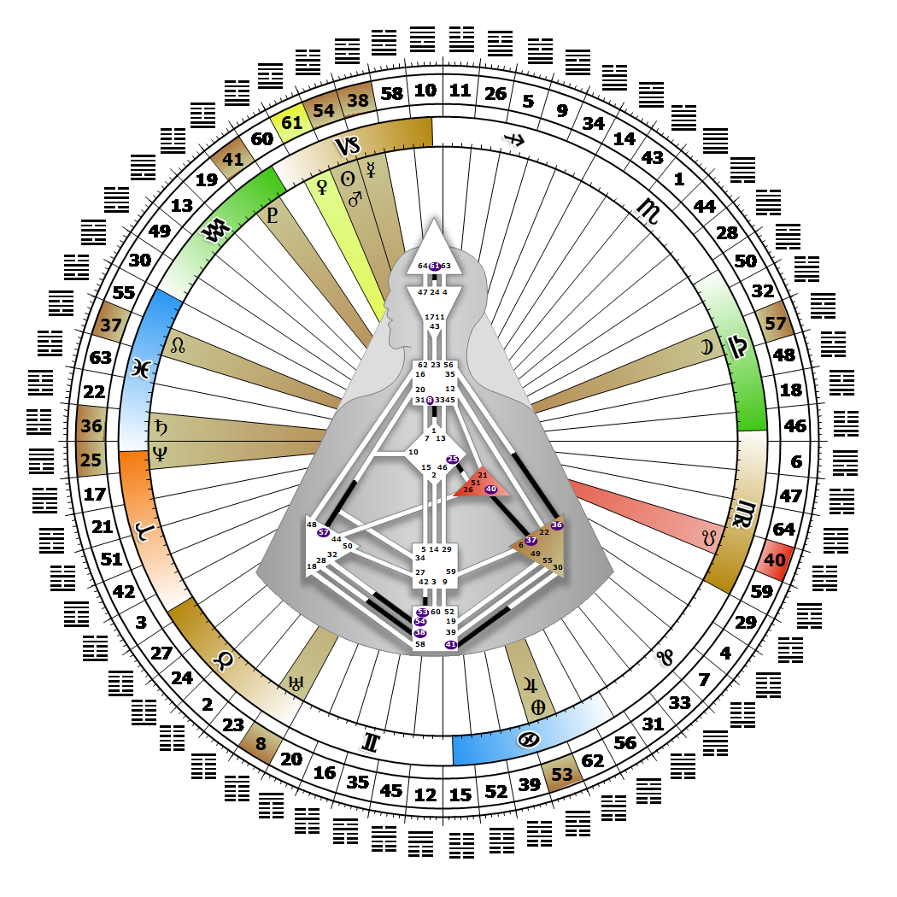

# 閘門 54 - 嫁娶少女

**2026年01月10日**

## *閘門（Gate）的雄心壯志 - 崛起的驅動力*

> 在平凡的社交互動中，同時也包含個人與神秘及宇宙層面的關係。透過掌握本能，轉化是可能實現的。

### 左角度交叉之循環 2 | 神性 - 毗濕奴

*突變之季，天狼星領域
主題：透過轉化實現目的
神秘主題：接納死亡*

---

此閘門隸屬於「轉化通道」（Channel of Transformation），屬於「受驅動的設計」（A Design of Being Driven），連結根部中心（Root Center，閘門54）與脾中心（Splenic Center，閘門32）。閘門54屬於部落（自我）迴路（Tribal (Ego) Circuit），其核心主旨為「支持」。

閘門54為人類提供轉化部落物質方向及在眾部落間地位的燃料與野心。它為我們最世俗的抱負、以及潛藏其中的至高靈性渴望提供能量。唯有當我們掌握在世俗層面蓬勃發展的本能後，靈性層次的轉化才可能發生。我們透過世俗層面實踐靈性理想，而野心即是個人潛能的實現。若在階層中獲得高位者青睞，我們便很有機會提升自身的生活地位。這種「向上攀升」的內在驅力，也為周遭的人帶來轉化的動力；它為他人創造公平競爭的環境，使眾人能在平等條件下競逐。然而，這股驅力需要方向引導，因此我們自然會尋求擁有閘門32的人，將自身野心導向具有持久價值的事物。若缺乏此方向指引，我們的驅力可能淪為盲目的野心。

---

### 第6行 - 選擇性

**☀️ 高階表達:** 根深蒂固的責任感，在維護安全與個人認同方面，會自然地將其關係限制在相互有益的範圍內。這種能量旨在限制那些阻礙抱負的關係。

**🌑 低階表達:** 一種普遍有益且擴展性的本質，假定自身能夠灌輸伴侶所缺乏的特質。這是一種能量的浪費。維持阻礙抱負的關係所導致的能量浪費。
